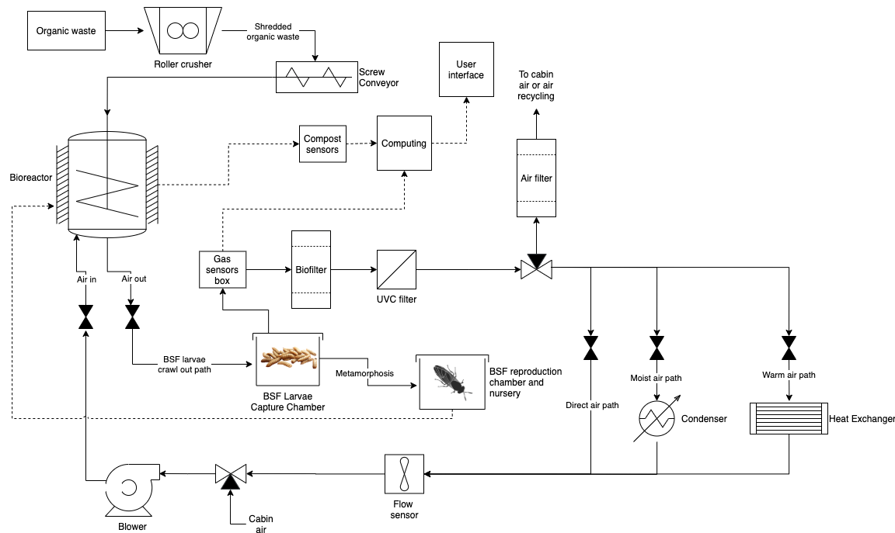

# Deep Space Food Challenge

The real report was submitted through an HTML form provided by the CSA. The current document contains the answers to each question found therein.

The design animation can be found [here on Youtube](https://www.youtube.com/watch?v=EAdfxVFPeCA).

Team:

* Audibert, Leo
* Bortnik, Andriy
* Kiddie, Benjamin
* Sawatzky, Dylan
* Werbes, Jovan

Due to the project being volunteer-based and everyone being busy, many members could not help throughout the full 6 months duration of our projects (Jan-July 2021) . However, we do thank them for their participation: Robyn McNeil, Ella Grandbois, Solal Audibert and Sohail Rajabi.

## 1. Design Abstract

For long duration missions in space, food recycling is a mission-critical problem. Our technology uses black soldier fly (BSF) larvae and microbiota to compost organic material within an automated system, producing nutrient-rich compost, animal protein, fertile insect excrement, heat, and carbon dioxide. These outputs can be utilized within other food-producing systems: the compost and excrement as fertilizer, the heat and carbon dioxide within the plant-growing process, and the insects for livestock (or human) consumption.

_**Provide a brief summary description of the food production technology to address the following questions:What is your proposed technology?What is novel, sustainable, and innovative about your proposed technology?What types of food does your technology produce?How are you minimizing inputs and maximizing food outputs? (maximum 1,500 characters)**_

According to a recent United Nations report, 17% of the food produced on Earth is wasted every year. This is an environmental and moral problem on Earth, but for long duration missions in space, this can also be a mission-critical one. This can be solved by efficient, automated, and sustainable composting of organic waste into valuable new resources. Our technology uses black soldier fly (BSF) larvae and microbiota to compost organic material within an automated and self-contained system, producing nutrient-rich and balanced compost, animal protein from the adult soldier flies, fertile frass (insect excrement), heat, and carbon dioxide. These outputs can be utilized within other food-producing systems: the compost and frass as fertilizer, the heat and carbon dioxide within the plant-growing process, and the insect protein for livestock (or human) consumption.

This novel technology automatically handles pathogen reduction, as the microbiota are thermophilic (i.e. use heat) during composting, which reduces pathogens to below detectable levels. Pathogen levels are continuously monitored using pathogen biosensors, and nutrient content is analyzed using Raman and LIBS spectrometers. An on-board software system optimizes the composting dynamics by suggesting the best materials to add at any given time, as well as any actions required by the crew. This is how the system minimizes the inputs of crew intervention and oxygen, and maximizes the useful outputs.

## 2. Design Report

### 2.1 Description of the food production technology

_**Describe what the technology is, what it does, how it functions, and how the crew will interact with it. Include descriptions of major hardware components and processes. (maximum 3,000 characters)**_

Our technology converts organic waste into usable resources. It consists of a shredder, multiple environmentally controlled compost bioreactors, and a nursery for BSFs. Organic refuse such as food waste and plant byproducts are loaded into the bioreactor through a slide with a lid, which protects the operator from any dangerous interaction with the shredder, and prevents any particulate matter from escaping into the crew environment. Shredding accelerates the decomposition process within the bioreactors. The shredded materials are routed to a non-full bioreactor where they are dried to 50% moisture content, optimal for BSFs. Once full, BSF larvae are introduced from the BSF nursery. If BSF larvae are not available, the compost can either wait for their readiness or be directly started in thermophilic composting. If BSF larvae have been added, the compost is maintained at 35ºC to optimize their activity and is kept aerobic by using forced aeration. After the BSFs self-harvest through an integrated exit, a thermophilic microbial inoculum (i.e. microbes that work at 50-70ºC) from an active or finished compost is added. In future design iterations, these may be replaced by hyperthermophilic microbes (>80ºC) due to increased efficiency in humification, composting speed, and pathogen sanitization. In both composting types, the compost is sanitized with a residence time of at least 3 days at a temperature greater than 55ºC, lowering pathogen levels to undetectable amounts. A biosensor measures the presence of E. coli as it is a reliable bioindicator of the presence of other pathogens. The compost is mechanically and automatically turned by an impeller so as to distribute the heat of the composting process evenly throughout. If further spectroscopic and biosensor analysis indicates that pathogens remain, the compost is thermostabilized, deactivating all microbes and enzymes. Self-harvested BSF make their way to a feed or a pupating container. The computing system controls their ratio to produce a sufficient number of eggs. Upon emerging from the pupating container, tubing channels them to the nursery, where they reproduce and lay eggs. The hatchlings fall into a container beneath the eggs where they will grow and be monitored by the machine-learning-based system until around their fifth day, at which point they may be added to a bioreactor. This step is necessary to assess their numbers and health. The BSF larvae or pupae meant for feed are captured in a dedicated bioreactor, which is emptied by the operator at the same time as the bioreactor.

Finished compost is stored within the reactor until the end-user empties it where required. The composting cycle restarts when new organic material is added to the empty bioreactor. Finally, the heat and carbon dioxide produced by the system can be routed to a greenhouse to support plant growth. 

_**Describe the basic operations concept of the food production technology. Describe assumptions required of operation. For example, is a sterile/aseptic environment needed? Are special steps required between production cycles? Must fluids or materials be removed or added to prime/inoculate a system? (maximum 1,500 characters)**_

This system is designed for maximum automation and therefore does not require significant crew interaction. The operator inserts organic waste in the shredder chute whenever it is available. Once full, the chute is closed and sealed. The chute can be designed to provide some minimal storage, such that a day’s worth of organic waste can be stored in the chute until it is processed in the evening. The loading process is anticipated to take less than 5 minutes per day. The operator is alerted by the system if the number of available BSF larvae is not sufficient to process a full bioreactor or if there are not enough to support the projected livestock’s feeding volumes. In this case, the operator must insert them into the system through a safe hatch which automatically sanitizes itself. When a bioreactor has been fully composted, the operator is alerted and can empty it where required, such as on a plant bed. These alerts can be sent at predefined times to minimize crew disruption. The bioreactor does not require cleaning as it will be sanitized at the next composting event.

The primary assumption of the system is that there will be a somewhat diverse set of organic waste materials available as input. While a minimal amount of organic waste material is required to sustain the BSF lifecycle, the viability of eggs, larvae, and pupae can be extended by cooler temperatures, allowing for periods with no available organic waste materials.

### 2.2 INNOVATION

_**Describe what makes the food production technology novel, innovative and sustainable. (maximum 3,000 characters)**_

No current technology upcycles organic waste into valuable fertilizer and animal protein through an automated system that can be used in space. The BSFs may be used to support small livestock such as poultry and fish, providing fresh meat and eggs and increasing crew morale and food familiarity. Insects such as the BSF are easy to breed and may provide most of the nutrients required to raise such livestock. BSF could further be powdered and added as an additive to human food, providing key nutrients without significantly affecting taste. BSFs are further apt at rapidly decomposing all sorts of organic waste, providing fertile compost and frass. Following the self-harvest of the BSF larvae, the microbial thermophilic composting step enhances the health and disease-suppressant qualities of the compost, while refining the BSF residue. Should we determine that hyperthermophilic aerobic bacteria fit our system better, these advantages will only be amplified. The finished compost may be mixed with treated extraterrestrial regolith to create a plant growing medium. The microbiota, if allowed to exist in the growing habitat, can create quality soils. The microbiota may further be sprayed on the soil as a compost tea to stimulate its humification, or on the plants to provide disease-suppressant qualities. The handling of living compost would be done in a way that is safe within the crew's habitat.

A suite of scientific instruments helps monitor the health and safety of the system. Among others, biosensors are used to detect volatiles produced through unwanted anaerobic decomposition and pathogen bioindicators such as E. coli. A Raman gas spectrometer, tucked in the ventilation system, assesses the health and progression of the compost without directly interacting with it. In addition, LIBS and Raman spectroscopes are routed to all bioreactors. While the Raman signal can be weak or masked by strong fluorescence from substances within the compost, research indicates its usefulness in soil and mineral analysis. Raman and LIBS are non-destructive and require no sample preparation, only needing light to be transported to and from the bioreactors and the spectrometers. While Raman informs about chemical bonds, LIBS discloses the elemental nature of our compost, allowing the monitoring of nefarious levels of toxicants such as heavy metals. Because the compost is mechanically turned, the spectrometers can sample a good representation of the compost. The Raman gas spectrometer tucked within the air circulation system tracks the volatiles within the composts’ atmospheres.

The machine learning (ML) based software analyses the sensor data and controls environmental conditions through classification of the spectroscopic data to analyze the nutrient and mineral content, regression to optimize the nutrient balance within the bioreactors, and anomaly detection of the various sensors and overall system.

### 2.3 ADHERENCE TO CONSTRAINTS

_**In Phase 1, Adherence to Constraints is not meant to determine whether the Design Report itself is complete in including all the required information. This question is meant to ensure that Teams have considered the constraints, and that the food production technology design, at a minimum, falls within those constraints. In future Phases, Teams’ food production technologies will be evaluated and scored on whether or not the design stays within the constraints so that it ultimately can meet CSA’s needs and deliver value.**_

_**Describe and/or confirm how the food production technology design adheres to the constraints listed below:**_

_**VOLUME: Food production technology must:**_

* _**Be ≤ 2 cubic meters**_
* _**Pass through a doorway that is 1.07 m wide and 1.90 m tall**_
* _**Fit in a room that is: 1.829 m X 2.438 m X 2.591 m (W x D x H)**_

_**(maximum 300 characters)**_

The central base measures about 1.8m in length, 0.5m in width and 0.3m in height, allowing it to fit seamlessly through a 1.07m by 1.90m doorway. The finished, fully assembled system measures 1.8m by 0.5m by 1.8m (l x w x h), taking up a volume of 1.62 cubic meters. 

_**POWER:**_

* _**Maximum draw of 3,000 Watts**_
* _**Average draw of <1,500 Watts**_

_**(maximum 300 characters)**_

Our system is energy efficient, heating itself up during composting. Compost cooling, turning and aeration are forecasted to be the largest energy consumers. However, we project to consume less than 1500 Watts on average.

_**WATER: Net consumption of water is not constrained, but greater net water consumption may result in a lower score on the Resource Inputs & Outputs performance requirement described later in the application. ([see Applicant Guide for reference](https://impact.canada.ca/en/challenges/deep-space-food-challenge/application-guide)).**_

* _**Net consumption of water is measured by the following equation:**_ $$C_{Net}$$ = _**(Initial water input + “new water” added over time)**_
* _**In this calculation:**_
  * _**Do not include water recycled by your system in the “new water”**_
  * _**Do not subtract the water remaining in your system after the food has been collected**_
  * _**Do not subtract water lost to the vehicle environment (e.g., water evaporated into the vehicle’s air)**_

_**(maximum 300 characters)**_

Initial water input may be required. However, since inputted organic material is first dried to reach 50%, the water content will be recycled and stored. Once composting is ready to begin, this water will be reinjected into the system. 

_**MASS: Not constrained, but greater mass may result in a lower score on the Resource Inputs & Outputs performance requirement ([see Applicant Guide for reference](https://impact.canada.ca/en/challenges/deep-space-food-challenge/application-guide)). (maximum 300 characters)**_

The environmental support system and scientific payload are projected to be the heaviest parts as they require to be structurally sound. Individual bioreactors are projected to weigh around 20-25 kg, of which there would be 8 in the current design. 

_**DATA CONNECTION: In Phase 1, the food production technology may be designed to transmit operational data and limited video to a remote location outside of the technology itself, and receive periodic operational commands. Future phases of this Challenge will require greater autonomy. (maximum 300 characters)**_

Operational data and commands are to be asynchronously transmitted from and to Earth. On-board software may further be updated in this manner. However, the system will act fully autonomously should a link not be present.

_**CREW TIME: Maintenance & Operations of the system: Not constrained, although Teams should target a maximum crew time of 4 hours per week for operations of the food production technology for the entire crew of 4 individuals. (maximum 300 characters)**_

An operator is necessary for the following operations: loading the organic waste into the shredder chute, inserting BSF larvae into bioreactors, retrieving produced insects, and discharging the finished compost. These manual operations should take no more than 1-2 hours a week.

_**OPERATIONAL CONSTRAINTS: Earth gravity (9.81 m/s²) and ambient atmospheric conditions of 101,325 Pascals, 22 degrees Celsius and 50 percent relative humidity. (maximum 300 characters)**_

The overall system is designed to operate within these constraints.

### 2.4 Describe how the food production technology addresses the following performance criteria (**[**see Applicant Guide for reference**](https://impact.canada.ca/en/challenges/deep-space-food-challenge/application-guide)**).

#### 2.4.1 ACCEPTABILITY

_**ACCEPTABILITY – Process**_

_**Operations processes and procedures, including how a person will set up and use the solution:**_

* _**Operational footprint (i.e., how much space is needed for the solution and its related processes?)**_
* _**Food production technology set upFood production cycle, including steps to produce food products**_
* _**Food handling, processing procedures and collection of food products**_
* _**Shutdown, cleaning, and/or stowage procedure(s)**_
* _**An estimate of the overall crew time to operate and maintain the technology**_

_**Provide an assessment (using industry standards and/or existing research) that your technology processes are likely to be user friendly and acceptable to crew. (maximum 3,000 characters)**_

The system has a floor footprint of 0.5m x 1.8m. It needs connections to power, water if available, and a heat exchanger if one is already available on the vessel. The bioreactors are slid onto the racks and automatically connect as they fasten to the environmental support base racks. For simplicity, our grinder is currently manually moved and connected to a specific bioreactor. A safer but more complicated solution is to have a fixed grinder which automatically routes ground organic waste to the bioreactors, likely through a flexible screw conveyor. We are, as of yet, unsure of how to best implement this second solution.The operator loads organic waste into the grinder chute. After closing it to prevent any unwanted backsplatter, the grinder can be manually turned on. A transparent window gives information to the operator of any possible issues occurring during the grinding process. The compost is automatically pushed into the bioreactor attached to the grinder. Once finished grinding, the system automatically locks the grinder chute in preparation for automated cleaning. The best automated cleaning method is yet to be determined.

Once the bioreactor is full, the operator is notified to add the BSF larvae. The system then automatically controls the composting and insect rearing process. Once ready, the BSF larvae self-harvest by moving to a higher, drier point. An egress route at the top of the container routes the larvae either to a feed or a pupation chamber. The operator is notified when the feed chamber is full. We have not yet determined how best to process and preserve the BSF captured in the feed chamber. After all larvae have migrated out of the reactor, the compost becomes fully microbial and the temperature is allowed to rise past the 35ºC that is optimal for BSF activity. Upon termination of the composting process, the operator is notified to empty the bioreactor. A cylinder of height 0.5m and diameter 0.3m is projected to weigh around 50kg when full with compost on the Earth’s surface. However, it will weigh 8kg on the Moon and 19kg on Mars, which is within the recommended guidelines of a maximum weight of 23kg by the Canadian Centre for Occupational Health and Safety (CCHST). After emptying the bioreactor, the cycle restarts.

**ACCEPTABILITY** – Food products

_**Provide an assessment (using industry standards and existing research) that the food outputs of your technology are likely to meet the acceptability target. This assessment should include appearance, aroma, palatability, flavor, and texture.**_

_**Rate and describe the potential acceptability of your food products on a 9 point hedonic scale ([see Applicant Guide for reference](https://impact.canada.ca/en/challenges/deep-space-food-challenge/application-guide)). (maximum 3,000 characters)**_

BSF can indirectly feed humans. They have been approved in Canada on a per-company basis for animal feed. This means they could potentially support a wide variety of livestock in deep space such as fowls and fish. The manure excreted by these livestock animals and their unwanted offalls may further be recycled in the composting system, closing the loop on a self-sustaining system. While fresh meat may be a rare luxury on a long-duration mission, its consumption is sure to invigorate crew morale. Furthermore, research indicates that BSF reared on clean substrate may be safe for human consumption. However, some knowledge gaps remain, and further research is required. Should that research support their safety, BSF may be processed into a powder to be added to any recipe so as to complete the astronauts’ nutrient intake. The taste and appearance of the BSF would thus be completely masked, reducing the impact of an unfamiliar ingredient. For the brave, they may even be roasted to create a crunchy snack. However, the processing of BSF for human consumption remains to be determined.

In addition to supporting fresh meat production, our system can support agricultural needs through its quality compost and frass, which may be used to foster soil formation and plant growth through healthy microbial activity and nutrient release. This application supposes that healthy microbial activity in soil is permitted on a long-duration mission due to safety concerns for the crew. Should it be used, beneficial relationships between plants and microbiota can promote growth and disease resistance. The heat generated through composting may also be used to heat plant-producing greenhouses.

#### 2.4.2 SAFETY

_**SAFETY – Process**_

_**Describe the safety of the food production process, including any potential operational risks for the technology; indicate how they may be mitigated on a three-year mission. Describe relevant food safety procedures. (maximum 3,000 characters)**_

 The largest risks are surrounding pathogen control and the cleaning of those parts of the system that come into contact with the organic waste. Pathogens must absolutely not be allowed to proliferate and be leaked into the crew habitat. Due to the sequestration of the system into separate bioreactors, an uncontrollable pathogen infection may be dealt with by thermostabilizing the bioreactor’s contents, killing all life in it, whether beneficial or adversarial. While such an event is unlikely due to the compost sanitization for 3 days at 65ºC+, that scenario must be handled if it ever arises. Following thermostabilization, a new healthy microbial population can be reinstated by transferring an inoculum from a healthy compost bioreactor. Since the air circulation system is planned to be shared between the bioreactors, it must not transfer contaminated air from one bioreactor to another. To that end, a UVC lamp will first decontaminate the air as it exits a bioreactor during air circulation through it, followed by a biofilter. It must be noted that only one bioreactor is aerated at a time. After disconnecting all bioreactors, the system will sanitize its air by circulating it through its UVC lamps and filter. Due to many unknowns, we are uncertain as to whether this mechanism will be sufficient for pathogen elimination in the air circulation system. If we find that it is insufficient during the next iteration of the prototype, each bioreactor will be allocated a separate, isolated air circulation system. While it may cause the system to become slightly heavier and more voluminous, these changes may be required for the system’s safe operation.

Spore-forming bacterias such as C. botulinum present a challenge as their resistant endospores allow them to survive high temperatures for a long time. The exact residence time may be increased after analysis throughout the composting process. Hyperthermophilic composting may be used instead of thermophilic composting if our analyses show the presence of these pathogens.

The implementation details of the shredder head remain unclear. We foresee the need to fully sanitize it after each use to remove the risk of releasing harmful microbes when opening the chute. While we have attempted our best to design a system that requires the least amount of human intervention, the cleaning of equipment that contains stuck pieces of organic waste may be difficult to automate. An operator may be needed. In any case, the cleaning system for the shredder is still under development.

A final point regarding the shredding system is whether to move it around between bioreactors, or whether the shredded output will be routed automatically to bioreactors. We currently opted for the first solution as it is the simplest mechanically. However, this design may change to maximize safety and minimize crew involvement.

_**SAFETY – Food products**_

_**Describe the safety of the resulting food products, including safety for repeated human consumption. (maximum 3,000 characters)**_

BSFs are currently approved in Canada as livestock feed only if fed on pre-consumer organic waste. This limitation is based on the inability to know what truly is present in public organic waste. BSF may act as bio accumulators of inorganic compounds: toxic metal, mycotoxins, pesticides, etc. Furthermore, there still exists a safety knowledge gap regarding their consumption, as is notable for most insect consumption in Western countries where entomophagy is rare. A handful of Canadian BSF-growing businesses have been granted the green card to sell to aquaculture farms, strongly indicating that tables are turning. Current research is active in the field and indicates that BSFs do not seem to accumulate contaminants above the thresholds set by the European Union for animal feed, except for certain metals like cadmium, lead, and zinc. In the event that unsafe material is added to the shredder (e.g. heavy metals, non-organic waste), the spectroscopes will alert the users that the bioreactor cannot be employed to produce edible insects or usable compost, and the content can be disposed of following a predefined process. While BSFs are known to be able to decompose feces, the larvae remain smaller and cannot be used as animal feed. 

BSFs have been shown to reduce microbial populations due to the high pH in their gut, their competitive gut bacteria, and enzymatic reactions, enabling them to significantly reduce pathogen levels in the substrate they consume, rendering it safer. BSF do not themselves carry any known zoonotic disease. In order to preserve them for consumption, heating has demonstrated a reduction in the microbial load, with blanching being the most effective to ensure microbial safety. Alternatively, other methods like powdering and heating, drying, UV treating, high-energy microwaving, and pasteurizing can be used. We currently assume that preservation techniques will be available on board. Should no existing preservation process be available, a preservation module can be added to our system. Storing the processed or dried BSF larvae in a cool environment such as a fridge presents the least risks for contamination growth and the longest shelf life.

#### 2.4.3 RESOURCE INPUTS & OUTPUTS

_**Describe the resource requirements of the food production process (inputs) and all outputs. Estimated quantities of each input and output should be provided:**_

_**INPUTS to the technology: (maximum 3,000 characters)**_

An oxygenated air supply is required for aerobic composting to take place. The air within a bioreactor will be partially renewed to remain at 10-12% oxygen throughout the composting cycle. Research indicates that 2 L/min/kg of aeration is required for healthy aerobic activity. This assumes that the larger astronaut habitat will provide air to our composting system. The current quantity of air aspirated from the crew habitat to renew oxygen is unknown as this heavily depends on the type of composting (regular, BSF, etc..) and can vary depending on materials and composting phase in the bioreactor. As such, in phase two, we will investigate the oxygenation kinetics to more accurately estimate the load on the crew air support systems.

Organic refuse is also required for our system to function. This quantity is variable as it is dependent on human (and possibly livestock) consumption byproducts. Depending on the final design, 0.14 cubic meters of shredded materials per bioreactor is needed before starting a cycle. While water from the bioreactors will be recaptured within our system, some will inevitably leak due to the air circulation system. We foresee that a 5L reservoir should be enough to support 8 bioreactors.

BSFs will need to initially be added to the system so as to start their reproduction cycle. Cryogenic technology is being developed by some companies to preserve BSF eggs. While this would be ideal to keep a backstock of BSF eggs should our BSF population collapse, our team has not yet reached out to these companies. It is, however, a promising way to strengthen the redundancy of our technology. In any case, once the BSF support system is primed with BSF eggs or larvae, the BSF rearing cycle will need no input.

_**OUTPUTS to the technology: (maximum 3,000 characters)**_

The outputs from the system are diverse and present both opportunities and challenges. BSF larvae and compost are the main outputs. A mass of 100kg of organic waste can be converted into about 40kg of BSF. The larval stage of the BSF takes about 18 days. Adding a week for thermophilic/hyperthermophilic composting to finish digesting the waste and destroy all pathogens, a bioreactor could provide a fresh quality compost load every month. While we have not explored this option, the industry generally separates BSF larvae from their substrate by vibration methods, allowing premature collection of BSF larvae. However, mature BSF larvae allow simplification of the harvesting system as their natural behaviour allows them to self-harvest. BSF can be processed into various forms following their recovery, such as milling them to use as a nutritional additive in animal and possibly human food. In addition to compost, research indicates that compost leachate and compost tea may allow some mineral recovery. Should compost be thermostabilized to be safely used in space, the fixated nutrients in the deceased microbiota are released in forms ready for plants to consume. Analysis of the compost throughout its lifetime can support specific applications that require specific composts, such as for example sprouting sensitive plants. 

Heat generation may be a challenging aspect of composting. The average heat production of various composts is 19MJ per kg of dry matter. This may present a challenge if the compost is large and in an environment that already requires cooling. However, should additional systems such as greenhouses require heating, our technology can benefit them tremendously. Cleaned moist air output from the compost could further be used to raise the humidity in greenhouses since it will be saturated with water at around 97%. This moist air would furthermore be rich in carbon dioxide, which may not be produced in high enough quantities by the astronauts themselves to support large agricultural facilities. In other words, in a complex system, some waste products from our technology may present opportunities for others.

While we do not foresee the need to remove water, the system may need to evacuate some should it become too saturated. In that case, the operator will be notified and a container within the system can be separated and emptied. Exhaust air may contain possible organic pathogens. Therefore, the system will clean the air internally using UVC and filters until pathogen levels are below the detection levels of our biosensors and Raman gas spectrometers. Before being released into the cabin or other systems, the air output from the compost could be routed to the main air recycling system to guarantee its safety through a double cleaning.

_**Describe how the food production technology achieves the greatest amount of food output in relation to the quantity of inputs and quantity of waste output. (maximum 1,500 characters)**_

The software control system monitors C:N ratios, pH, and mineral contents to minimize inputs, as well as to optimize plant growth. The two primary outputs, BSFs and compost, are optimized by controlling the composting conditions. BSFs thrive at around 30ºC, 50% soil humidity, a balanced pH, and a C:N ratio between 14:1 and 18:1. While BSFL can continue their activity in more unfavorable environments, the following conditions are detrimental and possibly deadly: anaerobic soil conditions, the temperature at or above 45ºC, soil moisture below 25%, or C:N ratio below 12:1 or above 20:1. Microbial decomposition may slow down in non-ideal or extreme conditions, but will not completely stop except if thermostabilized. Optimal conditions for composting are generally aligned with BSF. However, microbial thermophilic/hyperthermophilic composting cannot be allowed to begin while BSFs are present as the high temperatures would kill them. Once they have self-harvested, thermophilic composting is most efficient at 65ºC. At higher temperatures, the microbiota begins to perish and activity slows down. Should we decide to use hyperthermophilic bacteria, their activity is optimal at temperatures higher than 80ºC.

_**Describe the nutritional quality of the resulting food products:(maximum 3,000 characters)**_

BSF do not eat as adults. They must acquire all the energy they will expand during metamorphosis and reproduction in the larvae stage, resulting in larvae being rich in lipids and proteins. BSF meal and oil have been found to be good alternatives to fish meal and oil currently used to feed carnivorous livestock. Research indicates that 10-40% of BSFs in fish diets do not lower fish quality or health. Although each fish species requires a specific diet, substituting BSFs for a portion of their diet has been found to have no impact. BSFs are more sustainable in aquaculture as traditional feed relies on intensive farming and fish meal which result in the degradation of our environment. Furthermore, poultry farms have seen beneficial uses of BSFs, both as decomposers for the manure and as chicken feed. Current research also indicates similar flavor perceptions in the poultry meat and no changes in the oxidative status and cholesterol levels. However, higher levels of saturated and mono-saturated fatty acids were found. For this reason, BSF feed is sometimes defatted before use, which can be through simple mechanical pressing. Supplementation at 50% and complete feed replacement with BSFs were found to have no impact on laying hens and their eggs. BSFs can be grown on waste produced by the vertebrates they are used to feed without reducing their palatability, thus providing a highly efficient and sustainable food source.Reduction of polyunsaturated fats and/or increase of saturated and monounsaturated fats are a common concern with BSF. However, BSFs have far lower polyunsaturated fatty acid profiles than other insects like houseflies, mealworms, and adult crickets currently in use as animal or human food. The protein and fat content of BSF vary with their diet. Defatting of the larvae, such as by mechanical pressing, can assuage concerns over saturated fat contents.

BSFs are generally very good sources of proteins (about 40%) and lipids (about 30%) in terms of caloric macronutrient distribution. Their protein content is lower than other common edible insects, but is higher than plant-based feed and can thus be a viable alternative.

#### 2.4.4 RELIABILITY / STABILITY

_**RELIABILITY – Process**_

_**Describe how the food production technology can reliably perform its intended function. You may include:**_

* _**Operational lifespan (i.e., how long is the solution designed to last?)**_
* _**Whether there is less than 10% loss of functionality or food production**_
* _**Maintenance processes and procedures**_
  * _**Maintenance schedule (i.e., how often will it need maintenance?)**_
  * _**Component/element maintenance or replacement (i.e., what components will need to be replaced, and when?)**_
  * _**Critical spare parts for a three-year mission**_

_**(maximum 3,000 characters)**_

Our system is designed to be redundant and to last for a five-year mission without failure. The failure of an individual bioreactor does not stop the system as the production of BSF and compost is divided among 8 bioreactors. Should the microbiota in one be killed, other bioreactors containing healthy compost can be used to inoculate it. The modular design also offers easy replacement of whole subsystems or parts.The BSF support system will automatically collect emerging adults for reproduction as well as provide a dry surface above decomposing matter for egg-laying. BSFs are easy to rear, and adults mate easily in full sunlight. However, conditions favourable for reproduction are specific in a closed and non-naturally lighted reproduction chamber. Research indicates that a 30cm cube with UV, blue, and green LED lighting provides adequate reproduction conditions for 100 adults. Using at least two BSF reproduction chambers distributes the risk of system failure affecting the BSF adults. Our reproduction chambers are designed to be foldable so that 8-10 can be brought on board and deployed based on system needs while taking little space when not needed. Each female BSF lays between 500-700 eggs. While BSF adults do not have mouthparts, providing them with sugary water can double their lifespan, increasing successful oviposition rates. 

Sensors can be replaced as needed and will be selected for durability. The air circulation system is cleaned after every use to prevent any cross-contamination. If we choose to use isolated air circulation systems for each bioreactor for increased safety, cleaning is still required so as to not cross-contaminate between a finished and new compost. The bioreactors themselves will likely not need any internal cleaning beyond removing all finished composting products. Any leftovers from a previous compost will prime the next compost, and any possible pathogens will be sanitized during the thermophilic/hyperthermophilic stage.

The grinder will be cleaned after each use, but the exact method is still under development. Should a water cleaning system be used, seals will likely need to be changed before the end of the mission. Further, the impeller within the bioreactors will be designed for high durability.

_**STABILITY**_ 

_**Describe the stability of both the input products used and food product outputs. Description should include the estimated time the inputs and outputs will be fit for use and/or consumption (i.e., shelf-life). (maximum 1,500 characters)**_

The input organic waste is unstable and will start to mold and decompose rapidly. In order not to present any risks to the crew, it must be disposed of in the grinder chute as soon as possible. The inputs can somewhat be stabilized by drying them if the organic production faces a sudden shortfall and a compost bioreactor is only marginally filled. However, stability is not a major concern once the organic waste is safely stored in a bioreactor. The composting cycle can then be kickstarted by the addition of water and the BSF.

Additionally, while we did not include a preservation unit within our system for the consumable BSF, it may need to be added should the equipment not already be present on the vessel. For the longest shelf life, the BSF larvae can be heated or blanched, followed by drying and storage in a cool place. For shelf-life extending to multiple years, packaged BSF could instead be thermostabilized.

### 2.5 TERRESTRIAL POTENTIAL

_**Describe how the food production technology may have the potential to improve terrestrial food production. (maximum 3,000 characters)**_

The world population is projected to reach 10 billion by 2050. A proportional increase in meat production is expected. Producing enough animal feed will present challenges as it will require more space, water, and energy. Since most feed is of agricultural origin (cereal grains, soybeans, sugar beets...), an increase in production also results in the release of more insecticides, pesticides, and fungicides in our environment. Furthermore, unsustainable fish meals consisting of wild-caught small fish are also largely used in the feed industry. The switch to a largely insect-based diet can increase livestock sustainability and reduce their environmental impact. BSFs, in particular, can be raised in clean organic waste, a resource that is abundant in our consumer world where a UN report estimates that 17% of our food supply is wasted. BSFs are easy to breed and grow on a remarkably wide range of substrates. It is to be noted that BSFs have a fatty acid profile not necessarily suitable to all animals, especially to some varieties of fish. Regardless, they can be mixed with other insects or more traditional feed streams, completing a targeted and healthy diet while still reducing environmental impacts.

Our technology can be deployed in remote places throughout the world. The produced heat, BSFs, and compost can sustain livestock and plants even in cold climates such as the Canadian north. Our technology could easily be scaled up or down so as to create the backbone of a food production facility supporting any remote community. It is estimated that 72% of Europe’s biogas emissions are due to anaerobically decomposing organic waste in landfills. Research further indicates that BSFs reduce heavy metal contamination in digested waste, opening the possibility of using them as a step in the remediation of contaminated waste. Although they would become inedible, these BSF could potentially be used to produce biodiesel.The compost produced by the feed-producing system can be used as a biostimulant and biopesticide, promoting healthy microbiota and plant growth. Research indicates that repeated applications of compost tea can help revitalize damaged soils through the beneficial action of the microbial life contained in it. Healthy microbiota can also be used as a substitute for chemical pest management and chemical fertilizer, reducing harmful agricultural runoffs. 

Our system thus presents a highly integrated solution to many environmental challenges, including providing feed to our livestock and pets, reducing the dissemination of harmful agricultural chemicals, increasing the quality of soils, and reducing biogas emissions. Our long-term goal is to extend automated, enclosed insect farming to mealworms, house crickets, locusts, and houseflies, as these all provide excellent nutrient density and quality while being more efficient to produce than existing animal food sources.

### 2.6 Supporting material

_**Include any visual representations of the food production technology, which may include models, schematics, or drawings. (Maximum five (5) 8.5” x 11” pages; PDF; 16MB limit)**_

### 3. Design Animation

_**Submit a design animation (5-minute maximum length) showing the food production technology under operation (simulation) and include the following elements:**_

* _**Setup**_
* _**Operations from a user perspective**_
* _**Inputs and outputs**_
* _**Shutdown and cleaning**_

[Please click here to see the video on youtube](https://www.youtube.com/watch?v=EAdfxVFPeCA)

### 4. Intellectual Property

* _**Who owns the intellectual property of the proposed solution? Explain, taking into account the context of your organization.**_
* _**Is the solution built on existing or off-the-shelf technology protected by intellectual property (e.g. patents, copyrights, trade secret, etc.)? If so, detail the permissions (if applicable) you have to use that technology.**_

Our system does not use any known technology protected by intellectual property laws.

### 5. References

Adams, Z. (2005). *Understanding biothermal energy* (Doctoral dissertation, University of Vermont).

Albrecht, R., Le Petit, J., Terrom, G., & Périssol, C. (2011). Comparison between UV spectroscopy and nirs to assess humification process during sewage sludge and green wastes co-composting. *Bioresource Technology*, *102*(6), 4495-4500.

Aydogan, O., & Tasal, E. (2018). Designing and building a 3D printed low cost modular Raman spectrometer. *CERN IdeaSquare Journal of Experimental Innovation*, *2*(2), 3-14.

Bacon, C. P., Mattley, Y., & DeFrece, R. (2004). Miniature spectroscopic instrumentation: applications to biology and chemistry. *Review of Scientific instruments*, *75*(1), 1-16.

Banks, I. J., Gibson, W. T., & Cameron, M. M. (2014). Growth rates of black soldier fly larvae fed on fresh human faeces and their implication for improving sanitation. *Tropical medicine & international health*, *19*(1), 14-22.

Bertoldi, M. D., Vallini, G. E., & Pera, A. (1983). The biology of composting: a review. *Waste Management & Research*, *1*(2), 157-176.

Burge, W. D., Colacicco, D., & Cramer, W. N. (1981). Criteria for achieving pathogen destruction during composting. *Journal (Water Pollution Control Federation)*, 1683-1690.

Cerda, A., Artola, A., Font, X., Barrena, R., Gea, T., & Sánchez, A. (2018). Composting of food wastes: Status and challenges. *Bioresource technology*, *248*, 57-67.

Cooper, M., Douglas, G., & Perchonok, M. (2011). Developing the NASA food system for long‐duration missions. *Journal of food science*, *76*(2), R40-R48.

Courreges-Lacoste, G. B., Ahlers, B., & Perez, F. R. (2007). Combined Raman spectrometer/laser-induced breakdown spectrometer for the next ESA mission to Mars. *Spectrochimica Acta Part A: Molecular and Biomolecular Spectroscopy*, *68*(4), 1023-1028.

Diener, S., Zurbrügg, C., Gutiérrez, F. R., Nguyen, D. H., Morel, A., Koottatep, T., & Tockner, K. (2011). Black soldier fly larvae for organic waste treatment—prospects and constraints. *Proceedings of the WasteSafe*, *2*, 13-15.

D'souza, S. F. (2001). Microbial biosensors. *Biosensors and Bioelectronics*, *16*(6), 337-353.
Givens, M., Jeffay, N., Pierce, B., Robinson, W., & Mattox, J. (2013). The black soldier fly how-to-guide. *University of North Carolina, USA*.

Graves, R. E., Hattemer, G. M., & Stettler, D. (2000). Environmental engineering national engineering handbook. *National Engineering Handbook, USDA*.

Hendrickx, L., De Wever, H., Hermans, V., Mastroleo, F., Morin, N., Wilmotte, A., ... & Mergeay, M. (2006). Microbial ecology of the closed artificial ecosystem MELiSSA (Micro-Ecological Life Support System Alternative): reinventing and compartmentalizing the Earth's food and oxygen regeneration system for long-haul space exploration missions. *Research in microbiology*, *157*(1), 77-86.

Hogan, J. A., Perez, J. C. R., Lertsiriyothin, W., Strom, P. F., & Cowan, R. M. (2001). *Integration of composting, plant growth and biofiltration for advanced life support systems* (No. 2001-01-2211). SAE Technical Paper.

Hogan, J. A., & Finstein, M. S. (1991). Composting of solid waste during extended human travel and habitation in space. *Waste management & research*, *9*(1), 453-463.

Ingham, E. (2005). *The compost tea brewing manual* (Vol. 728). Corvallis, OR, USA: Soil Foodweb Incorporated.

Jones, P., & Martin, M. (2003). A review of the literature on the occurrence and survival of pathogens of animals and humans in green compost. *WRAP standards report. The Waste and Resources Action Programme, Oxon, United Kingdom*.

Lin, Q., Niu, G., Wang, Q., Yu, Q., & Duan, Y. (2013). Combined laser-induced breakdown with Raman spectroscopy: historical technology development and recent applications. *Applied Spectroscopy Reviews*, *48*(6), 487-508.

Maurer, V., Holinger, M., Amsler, Z., Früh, B., Wohlfahrt, J., Stamer, A., & Leiber, F. (2016). Replacement of soybean cake by Hermetia illucens meal in diets for layers. *Journal of Insects as Food and Feed*, *2*(2), 83-90.

Mendell, W. W. (1985). *Lunar bases and space activities of the 21st century* (pp 621-651). Lunar and Planetary Institute.

Moo-Young, M., & Chisti, Y. (1994). Bioreactor applications in waste treatment. *Resources, conservation and recycling*, *11*(1-4), 13-24.

Newton, L. A. R. R. Y., Sheppard, C. R. A. I. G., Watson, D. W., Burtle, G. A. R. Y., & Dove, R. O. B. E. R. T. (2005). Using the black soldier fly, Hermetia illucens, as a value-added tool for the management of swine manure. *Animal and Poultry Waste Management Center, North Carolina State University, Raleigh, NC*, *17*, 18.

Nguyen, T. T., Tomberlin, J. K., & Vanlaerhoven, S. (2015). Ability of black soldier fly (Diptera: Stratiomyidae) larvae to recycle food waste. *Environmental entomology*, *44*(2), 406-410.

Noble, R., & Roberts, S. J. (2004). Eradication of plant pathogens and nematodes during composting: a review. *Plant pathology*, *53*(5), 548-568.

Perchonok, M., & Bourland, C. (2002). NASA food systems: past, present, and future. *Nutrition*, *18*(10), 913-920.

Robles-González, I. V., Fava, F., & Poggi-Varaldo, H. M. (2008). A review on slurry bioreactors for bioremediation of soils and sediments. *Microbial Cell Factories*, *7*(1), 1-16.

Rodríguez-Meza, M. A., Chávez-Gómez, B., Poggi-Varaldo, H. M., Ríos-Leal, E., & Barrera-Cortés, J. (2010). Design of a new rotating drum bioreactor operated at atmospheric pressure on the bioremediation of a polluted soil. *Bioprocess and biosystems engineering*, *33*(5), 573-582.

Senesi, G. S., Dell'Aglio, M., De Giacomo, A., De Pascale, O., Chami, Z. A., Miano, T. M., & Zaccone, C. (2014). Elemental composition analysis of plants and composts used for soil Remediation by laser‐induced breakdown spectroscopy. *Clean–Soil, Air, Water*, *42*(6), 791-798.

Schuerger, A. C., Golden, D. C., & Ming, D. W. (2012). Biotoxicity of Mars soils: 1. Dry deposition of analog soils on microbial colonies and survival under Martian conditions. *Planetary and Space Science*, *72*(1), 91-101.

Sheppard, D. C., Tomberlin, J. K., Joyce, J. A., Kiser, B. C., & Sumner, S. M. (2002). Rearing methods for the black soldier fly (Diptera: Stratiomyidae). *Journal of medical entomology*, *39*(4), 695-698.

Su, Liang, et al. "Microbial biosensors: a review." *Biosensors and bioelectronics* 26.5 (2011): 1788-1799.

Tinnefeld, P., & Sauer, M. (2005). Branching out of single‐molecule fluorescence spectroscopy: Challenges for chemistry and influence on biology. *Angewandte Chemie International Edition*, *44*(18), 2642-2671.

Wang, Y. S., & Shelomi, M. (2017). Review of black soldier fly (Hermetia illucens) as animal feed and human food. *Foods*, *6*(10), 91.

Wei, J., Wang, A., Lambert, J. L., Wettergreen, D., Cabrol, N., Warren‐Rhodes, K., & Zacny, K. (2015). Autonomous soil analysis by the Mars Micro‐beam Raman Spectrometer (MMRS) on‐board a rover in the Atacama Desert: a terrestrial test for planetary exploration. *Journal of Raman Spectroscopy*, *46*(10), 810-821.

Xing, Z., Du, C., Zeng, Y., Ma, F., & Zhou, J. (2016). Characterizing typical farmland soils in China using Raman spectroscopy. *Geoderma*, *268*, 147-155.

Yun, Y. S., Park, J. I., Suh, M. S., & Park, J. M. (2000). Treatment of food wastes using slurry-phase decomposition. *Bioresource technology*, *73*(1), 21-27.

Yu, S., Clark, O. G., & Leonard, J. J. (2005). Airflow measurement in passively aerated compost. *Canadian biosystems engineering*, *47*(6), 39-45.

Zabel, P., Bamsey, M., Schubert, D., & Tajmar, M. (2016). Review and analysis of over 40 years of space plant growth systems. *Life sciences in space research*, *10*, 1-16.

Zhu, M., Wang, Q., Wang, M., Peng, X., Qu, J., Sun, L., & Liu, L. (2015, August). Combined remote LIBS and Raman system for identifying the composition of minerals. In *2015 Optoelectronics Global Conference (OGC)* (pp. 1-3). IEEE.